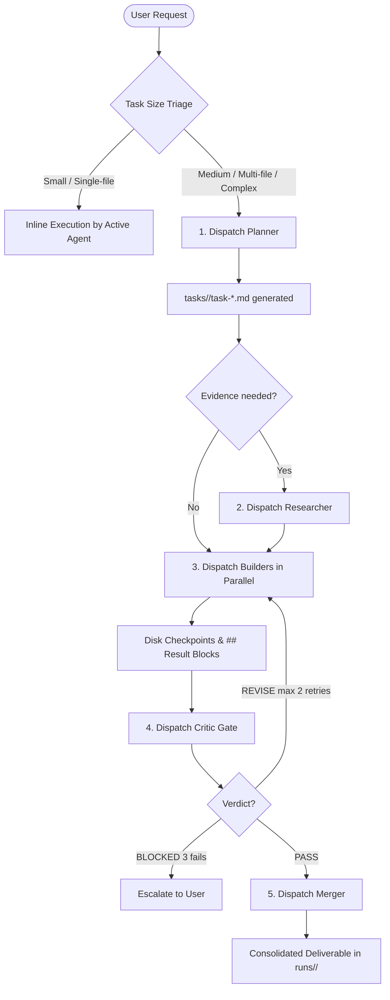

# Universal Orchestrator Specification & Protocol (RikkaHub Standard)

This document defines the **Universal Orchestrator Contract** across all VS Code agent harnesses (Antigravity, Claude Code, GitHub Copilot, Codex, Kilo Code).

> [!IMPORTANT]
> **Harness-Agnostic Principle**
> Whichever agent harness is currently active (Antigravity, Claude Code, Copilot, Codex, or Kilo Code) **assumes the role of Universal Orchestrator**. The orchestrator manages task decomposition, dispatches specialized roles, verifies deliverables on disk, and coordinates work without altering project files or relying on harness-specific memory.

---

## 1. Multi-Agent Dispatch Matrix

When executing tasks as the Orchestrator, dispatch work according to the 6 canonical roles:

### Roster Roles & Dispatch Targets

| Role | Antigravity | Claude Code | Kilo Code | Codex / Generic | Purpose |
|---|---|---|---|---|---|
| **Planner** | `invoke_subagent(TypeName='planner')` | `/agent planner` or subagent | `.kilo/agents/planner.md` | `rikkahub-codex-environment/agents/planner.md` | Decomposes goal into atomic tasks under `tasks/<runid>/` |
| **Researcher** | `invoke_subagent(TypeName='researcher')` | Subagent `researcher` | `.kilo/agents/researcher.md` | `.../agents/researcher.md` | Fact-checking, web/code evidence, confidence score |
| **Builder** | `invoke_subagent(TypeName='builder')` | Subagent `builder` | `.kilo/agents/builder.md` | `.../agents/builder.md` | Implements disjoint code units, outputs `## Result` |
| **Critic** | `invoke_subagent(TypeName='critic')` | Subagent `critic` | `.kilo/agents/critic.md` | `.../agents/critic.md` | Blind review against criteria: `PASS`, `REVISE`, `BLOCKED` |
| **Designer** | `invoke_subagent(TypeName='designer')` | Subagent `designer` | `.kilo/agents/designer.md` | `.../agents/designer.md` | 4-phase design pipeline (flow $\rightarrow$ look $\rightarrow$ contract $\rightarrow$ UI) |
| **Merger** | `invoke_subagent(TypeName='merger')` | Subagent `merger` | `.kilo/agents/merger.md` | `.../agents/merger.md` | Unifies validated outputs into final delivery |

---

## 2. Universal Protocol Rules

1. **State Lives on Disk (Not in Chat Context)**:
   - Tasks: `tasks/<runid>/task-<id>.md`
   - Knowledge / Shared Facts: `knowledge/<runid>/` or project docs
   - Deliverables: `runs/<runid>/`
   - Any agent taking over reads these directories to continue seamlessly.

2. **RESULT-LAST Rule**:
   - Every worker/sub-agent must conclude its output with a clean markdown `## Result` block.
   - Only the final `## Result` block is trusted by the orchestrator.

3. **SUCCEEDED $\neq$ Done**:
   - A sub-agent reporting "success" or "finished" is never taken on faith.
   - The Orchestrator **must inspect disk state and verify file modifications** before advancing to the Critic.

4. **Blind Critic Quality Gate**:
   - The Critic evaluates outputs strictly against the acceptance criteria defined by the Planner.
   - Max 3 revision cycles. If after 3 iterations the task does not achieve `PASS`, halt and escalate the decision to the user.

5. **No Worker-to-Worker Chat**:
   - Workers communicate exclusively via file inputs and outputs on disk. No peer chat or conversational drift.
